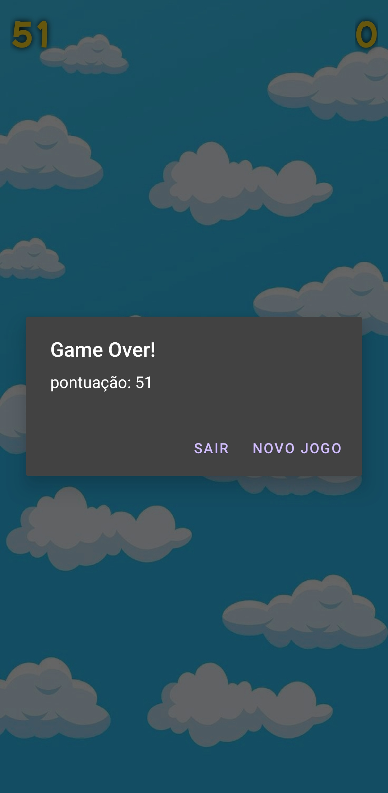
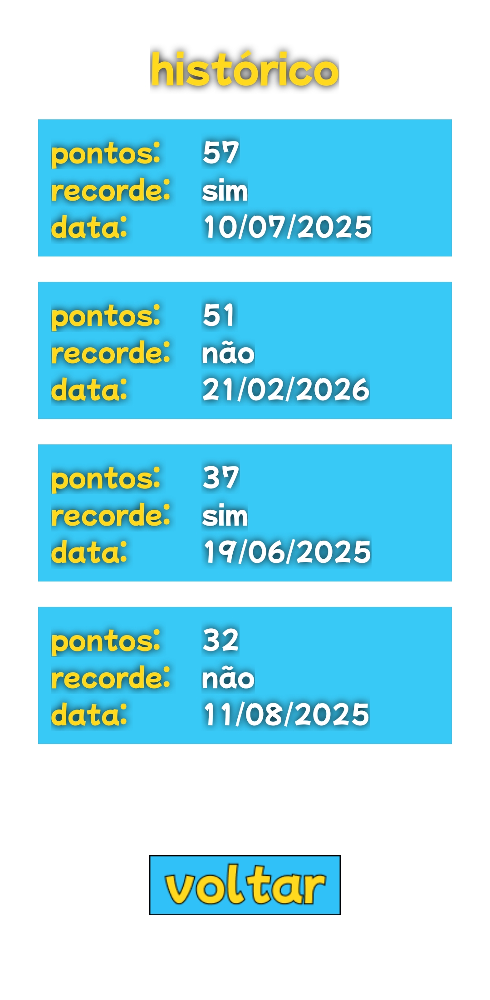

## Jogo Android Ache o Homer

### Como Jogar  
- clique em iniciar
- você tem 40 segundos para clicar no Homer, seja rápido, porque ele irá desaparecer
- após a partida terminar, você pode escolher sair ou jogar uma nova partida  
- veja o histórico das suas partidas no botão histórico na tela inicial

  

  
  
  
  
  

